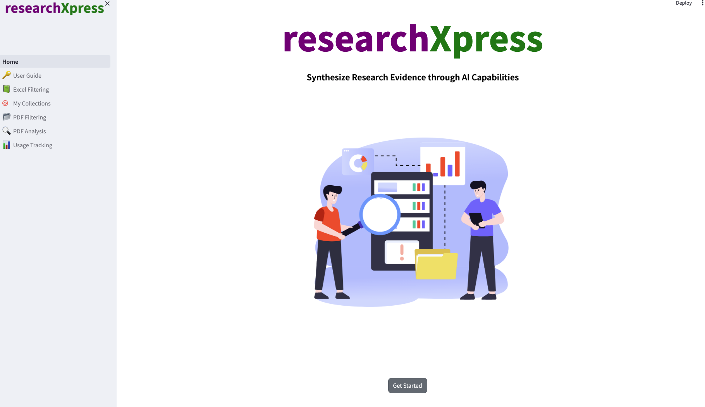
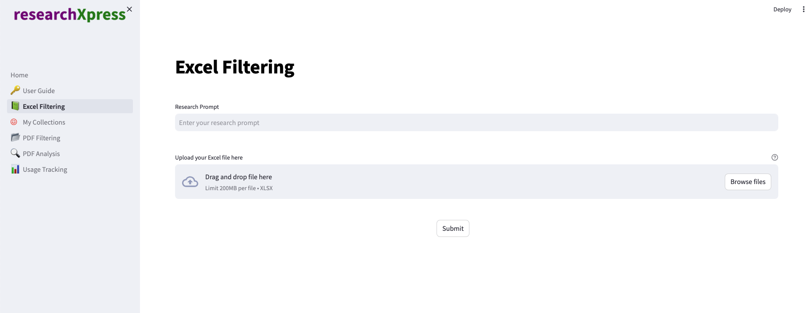
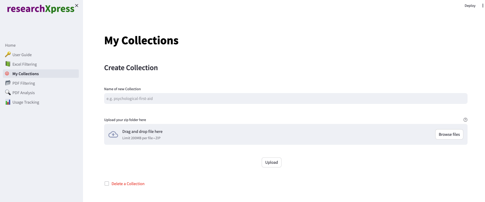
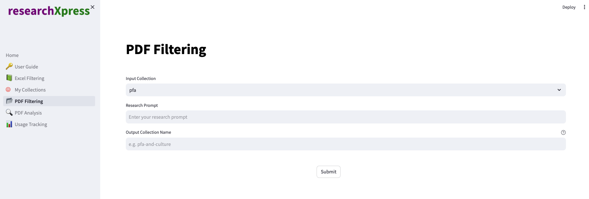
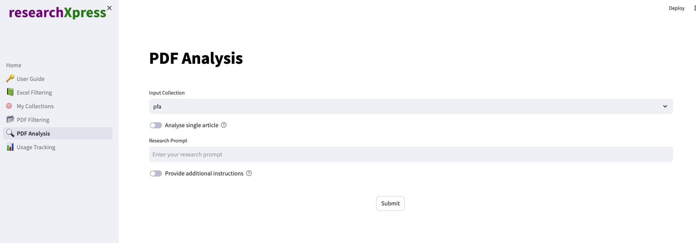
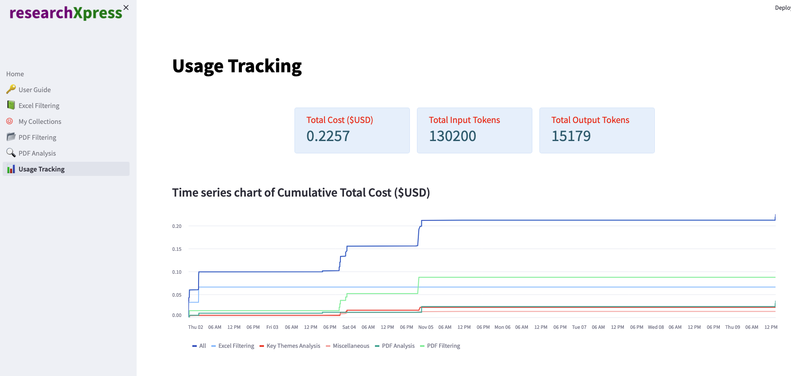

<p align="center">
  
</p>

## Table of Contents

-   [💡 Overview ](#-overview)
-   [🖥 Tech Stack](#-tech-stack)
-   [🔧 Running The Dashboard](#-running-the-dashboard)
-   [📄 Pages](#-pages)
-   [🫂 Team](#-team)

## 💡 Overview

Psychological researchers face a demanding and laborious process as they painstakingly review academic articles to determine their relevance and then manually combine the research findings. This
process is time-consuming and can be quite taxing

## 🖥 Tech Stack

<div>
	
	
	
	
</div>

## 🔧 Running The Dashboard

### Prerequisite

-   Python should have been installed
-   Ideally a virtual environment should be created

### Install all the relevant libraries

```
pip install -r requirements.txt

```

### Launching the dashboard

```
streamlit run Home.py

```

### Exiting the dashboard

```
ctrl + c

```

## 📄 Pages

### 🏘 Home Page


<br/>

### 🔑 User Guide Page


<br/>

### 📗 Excel Filtering Page

Filter an excel file of articles with a research prompt and view results


<br/>

### ☺️ My Collections Page

Create your own collection of pdfs with a few clicks

 <br/>

### 📂 PDF Filtering Page

Filter a folder of PDF articles with a yes/no research prompt and view results

 <br/>

### 🔍 PDF Analysis Page

Query PDF articles with a research prompt


<br/>

### 📊 Usage Tracking Page

Track your LLM model usage


<br/>

## 🫂 Team

<a href="https://github.com/hwhmervyn/researchXpress_Capstone/graphs/contributors">
  
</a>
